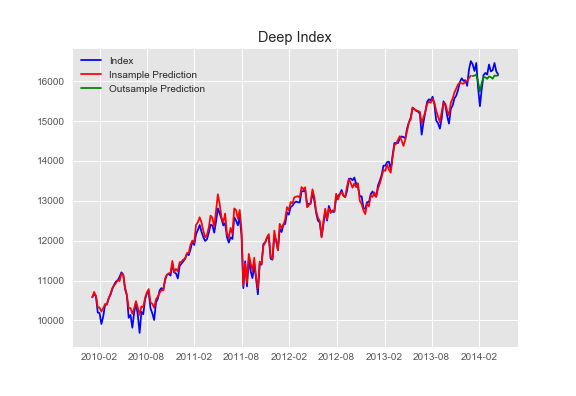
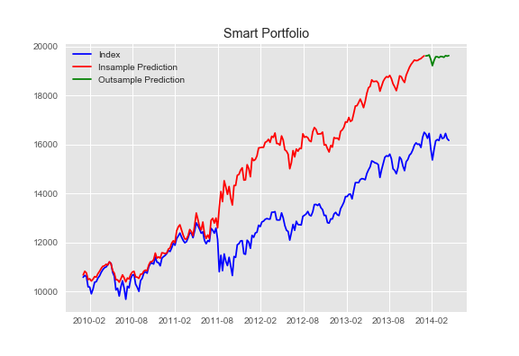
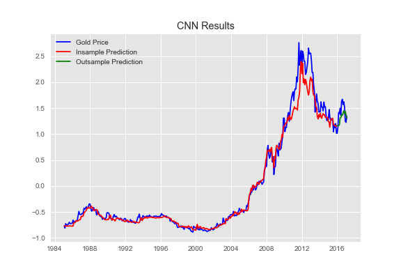
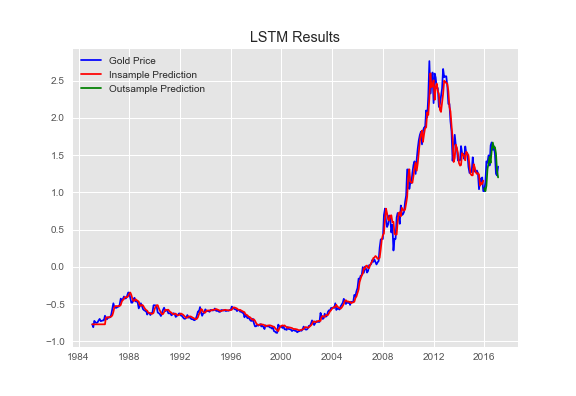

# Deep Learning in Finance Repository

This repository contains the code used for implementing deep learning techniques in finance, as presented at the RE-WORK Deep Learning in Finance Conference in Singapore by Sonam Srivastava.

## Presentation Video

The presentation video titled "Deep Learning in Finance" can be accessed at [this link](http://videos.re-work.co/events/22-deep-learning-in-finance-summit-singapore-2017).

## Overview

The repository focuses on two main studies conducted in the field of deep learning in finance:

1. Return Prediction: ARIMA, CNN, and LSTM models were implemented to predict the price movements of gold. The performance and accuracy of these models were compared, and their results are showcased in different charts.

2. Portfolio Construction: A smart indexing approach based on deep neural networks and autoencoders was employed for portfolio construction. The repository includes code for developing and evaluating the performance of a smart portfolio.

## Charts

The repository includes three charts that provide insights into the analysis conducted:

### 1. Deep Index

The Deep Index chart demonstrates the predictions and performance of ARIMA, CNN, and LSTM models applied to an index dataset. It includes both insample and outsample predictions. Insample predictions showcase how well the models fit the training data, while outsample predictions evaluate the models' accuracy in predicting unseen data. The Deep Index chart enables a comprehensive assessment of the performance of ARIMA, CNN, and LSTM models in predicting gold price movements.

### 2. Smart Portfolio

The Smart Portfolio chart illustrates the construction and performance of a portfolio using smart indexing techniques based on deep neural networks and autoencoders. The chart includes an index that represents the performance of the portfolio over time. It showcases both insample and outsample predictions, providing insights into the effectiveness of the smart indexing approach in capturing market trends and generating returns.

### 3. CNN and LSTM Results

The CNN and LSTM Results charts present the outcomes of CNN and LSTM models applied to financial data for return prediction. They include an index that represents the predicted values generated by the models. The charts display both insample and outsample predictions, highlighting the models' abilities to capture patterns and dependencies in the gold price data.

- CNN Results:

  

- LSTM Results:

  

## Instructions

To replicate the analyses and visualize the results, follow the instructions provided in the respective directories for each study. Detailed explanations and code are available within each directory.

## Requirements

Make sure you have the following dependencies installed:

- Python (version 3.8)

